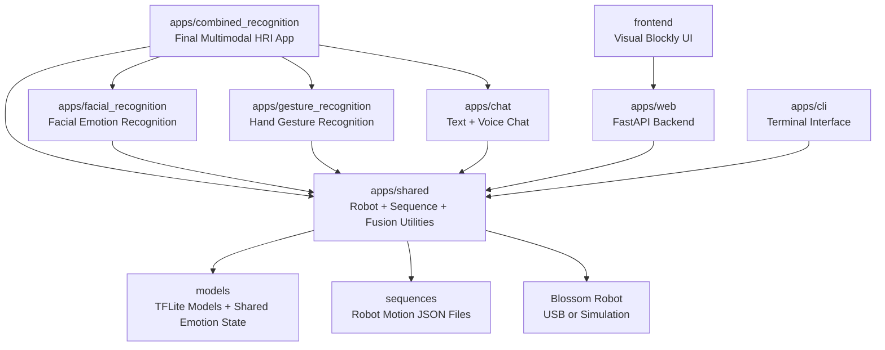

# HRIBlossom

HRIBlossom is a Human-Robot Interaction (HRI) research platform for controlling **Blossom**, a soft expressive robot with five motorized degrees of freedom: three tower joints, a rotating base, and movable ears. The project supports robot control through a terminal CLI, a web API, a visual Blockly-style frontend, a chatbot, webcam-based facial emotion recognition, webcam-based hand gesture recognition, and a final combined multimodal emotion-recognition system.

The final project version adds a **single combined emotion interaction app** that uses three possible emotion sources:

1. **Facial expression recognition** from the webcam.
2. **Hand gesture recognition** from the webcam.
3. **Conversation emotion detection** from voice or typed text.

The app fuses any available source or combination of sources into one final target emotion:

- `happy`
- `sad`
- `angry`

> **No robot? No problem.** Most applications fall back to simulation mode if Blossom is not physically connected. You can still test the chatbot, camera pipelines, recognition models, and sequence logic without hardware.

---

## Table of Contents

1. [Project Overview](#project-overview)
2. [Final Project Features](#final-project-features)
3. [How the Final System Works](#how-the-final-system-works)
4. [Prerequisites](#prerequisites)
5. [Getting the Project Files](#getting-the-project-files)
6. [Python Environment Setup](#python-environment-setup)
7. [Environment Variables](#environment-variables)
8. [Hardware Setup](#hardware-setup)
9. [Running the Final Combined System](#running-the-final-combined-system)
10. [Running the Individual Applications](#running-the-individual-applications)
11. [Training the Models](#training-the-models)
12. [Project Structure](#project-structure)
13. [Important Code Corrections and Project Changes](#important-code-corrections-and-project-changes)
14. [Known Issues and Limitations](#known-issues-and-limitations)
15. [Troubleshooting](#troubleshooting)

---

## Project Overview

HRIBlossom is a monorepo containing several independent sub-projects that share the same core robot-control library. Each app can use the same sequence files, robot configuration, model files, and communication utilities.



| Component | Purpose |
|---|---|
| `apps/combined_recognition` | Final project app combining face, hand gesture, and conversation emotion detection. |
| `apps/facial_recognition` | Webcam-based facial emotion recognition. |
| `apps/gesture_recognition` | Webcam-based hand gesture recognition. |
| `apps/chat` | Text and voice chatbot utilities, including conversation emotion detection. |
| `apps/shared` | Robot driver, sequence utilities, TFLite classifier wrapper, emotion fusion, shared emotion state. |
| `apps/web` | FastAPI backend for robot control. |
| `apps/cli` | Terminal app for listing and playing sequences. |
| `frontend` | Visual block-based interface for creating and playing sequences. |
| `models` | Trained `.tflite` models and generated shared state files. |
| `sequences` | JSON motion sequences for Blossom. |

---

## Final Project Features

The final project adds a multimodal emotion-aware HRI pipeline that lets Blossom respond to the user using multiple signals at once.

### Final App Capabilities

The final app is:

```powershell
uv run python -m apps.combined_recognition.main
```

It provides:

- A live camera window.
- Face landmark detection and facial emotion classification.
- Hand landmark detection and gesture classification.
- Hold-to-talk voice input using the space bar.
- A popup text chat window opened with Enter.
- Conversation emotion detection from both spoken and typed messages.
- Real-time emotion fusion from any available source.
- Robot sequence triggering based on the final emotion.
- Simulation mode if the physical robot is unavailable.

### Controls

| Control | Action |
|---|---|
| Hold `SPACE` | Record voice input. |
| Release `SPACE` | Transcribe the recorded voice and send it to the chatbot. |
| Press `ENTER` | Open the text chat popup. |
| Type in popup + press `ENTER` | Send a typed chat message. |
| Close popup | Return to camera and voice mode. |
| Press `q` in camera window | Quit the app. |

### Emotion Sources

The final app can work with any of these sources:

| Source | Description |
|---|---|
| Facial expression | Webcam face mesh landmarks are classified by `emotion_classifier.tflite`. |
| Hand gesture | Webcam hand landmarks are classified by `gesture_classifier.tflite`. |
| Conversation | Spoken or typed language is classified into `happy`, `sad`, or `angry`. |

The final emotion is **not contingent on all three sources being present**. The system automatically reweights the available sources.

| Available Sources | Fusion Behavior |
|---|---|
| Face only | Face = 100% |
| Gesture only | Gesture = 100% |
| Conversation only | Conversation = 100% |
| Face + gesture | Face = 50%, gesture = 50% |
| Face + conversation | Face = 50%, conversation = 50% |
| Gesture + conversation | Gesture = 50%, conversation = 50% |
| Face + gesture + conversation | Each source = 33.3% |

---

## How the Final System Works

The final app performs one continuous loop:

1. Capture the current camera frame.
2. Run MediaPipe Face Mesh on the frame.
3. Run MediaPipe Hands on the frame.
4. Convert detected landmarks into normalized keypoint features.
5. Run the facial and gesture `.tflite` classifiers when those features are available.
6. Listen for user voice input through hold-to-talk.
7. Open the text popup when Enter is pressed.
8. Detect conversation emotion from typed or spoken input.
9. Fuse any available emotion sources into one final emotion.
10. Trigger a robot sequence if a physical Blossom is connected and the confidence threshold is met.

### Target Emotions

The final fusion system uses:

```text
happy
sad
angry
```

The current facial model originally recognizes:

```text
happy
sad
neutral
surprised
```

Because the facial model does not currently include an explicit `angry` class, anger is mainly detected through the gesture classifier and conversation emotion detector. Future improvements should retrain the facial model with an angry class.

---

## Prerequisites

Install the following tools before running HRIBlossom.

### 1. Python 3.12

1. Download Python 3.12 from [https://www.python.org/downloads/](https://www.python.org/downloads/).
2. Run the installer.
3. Check **Add python.exe to PATH** before installing.
4. Verify in PowerShell:

```powershell
python --version
```

Expected output:

```text
Python 3.12.x
```

### 2. uv

`uv` manages the Python environment.

Install it in PowerShell:

```powershell
powershell -ExecutionPolicy ByPass -c "irm https://astral.sh/uv/install.ps1 | iex"
```

Close and reopen PowerShell, then verify:

```powershell
uv --version
```

### 3. Git

Install Git from [https://git-scm.com/download/win](https://git-scm.com/download/win).

Verify:

```powershell
git --version
```

### 4. Node.js

Node.js is only required for the visual frontend.

Install the LTS version from [https://nodejs.org/](https://nodejs.org/).

Verify:

```powershell
node --version
npm --version
```

> Note: Node.js installation may require multiple attempts depending on machine permissions, PATH updates, and whether PowerShell was reopened after installation.

---

## Getting the Project Files

### Clone the repository

```powershell
git clone https://github.com/your-username/HRIBlossom.git
cd HRIBlossom
```

If the folder already exists, navigate to it:

```powershell
cd "C:\Users\your-username\Documents\GitHub\HRIBlossom"
```

All commands in this README assume you are running them from the project root:

```text
HRIBlossom/
```

---

## Python Environment Setup

Run:

```powershell
uv sync
```

This creates the `.venv/` virtual environment and installs the locked dependencies.

### Required MediaPipe Version

For the final project, the working MediaPipe version is:

```powershell
uv add mediapipe==0.10.14
```

This is important because newer dependency combinations caused the following issue:

```text
AttributeError: module 'mediapipe' has no attribute 'solutions'
```

Verify MediaPipe after installation:

```powershell
uv run python -c "import mediapipe as mp; print(mp.__version__); print(mp.solutions.face_mesh); print(mp.solutions.hands)"
```

Expected version:

```text
0.10.14
```

### AutoGen Dependency Note

AutoGen was tested as a possible emotion-detection agent, but it introduced a dependency conflict with MediaPipe because AutoGen required `protobuf 5.x`, while `mediapipe==0.10.14` required `protobuf <5`. For this project, MediaPipe is required for face and hand recognition, so AutoGen was removed and conversation emotion detection was implemented as a direct OpenAI-based agent wrapper.

If AutoGen was previously installed, remove it:

```powershell
uv remove autogen-agentchat autogen-ext
uv add mediapipe==0.10.14
```

---

## Environment Variables

Create a file named `.env` in the project root:

```text
HRIBlossom/.env
```

Use the following environment values:

```env
OPENAI_API_KEY="API KEY from Dr Berry"
GROQ_API_KEY="APY KEY from https://console.groq.com/home"
```

> Important: `.env` contains private API keys. Do not commit it to a public GitHub repository. The OpenAI key may be provided by Dr. Berry because OpenAI charges per API call. Groq can be used as a free alternative if the project is adapted to use Groq models.

---

## Hardware Setup

### Power and USB Connection

Blossom should not be powered only by the laptop USB connection. The laptop connection is used for communication with the board, but the laptop does not provide enough power for the robot motors. Use the proper motor power source for the robot.

Correct setup:

1. Connect the controller board to the laptop by USB.
2. Power the motors using the appropriate external power connection.
3. Confirm that the board appears as a COM port in Windows Device Manager.

### COM Port Setup

The COM port may differ by computer. Check Device Manager:

1. Press `Win + X`.
2. Open **Device Manager**.
3. Expand **Ports (COM & LPT)**.
4. Find the serial device for the Blossom controller board.
5. Note the COM number, such as `COM3`, `COM5`, or `COM7`.

Update the COM port in:

```text
apps/shared/models/robot_config.py
```

Example:

```python
PORT = "COM5"
```

If the robot is not connected, the software should continue in simulation mode.

### Mechanical Notes

The robot springs can fall out easily during movement or handling. If Blossom begins moving incorrectly or appears physically misaligned, inspect and reseat the springs before debugging the software.

---

## Running the Final Combined System

Run:

```powershell
uv run python -m apps.combined_recognition.main
```

A camera window opens and displays:

- Face detection overlays.
- Hand detection overlays.
- Final fused emotion.
- Source weights.
- Conversation emotion, if available.
- Last user message and Blossom response.

### Final App Controls

| Control | Action |
|---|---|
| Hold `SPACE` | Start recording voice. |
| Release `SPACE` | Stop recording, transcribe speech, detect conversation emotion, send to chatbot. |
| `ENTER` | Open text chat popup. |
| Type in popup + `ENTER` | Send typed message. |
| Close popup | Return to voice mode while keeping camera visible. |
| `q` | Quit app. |

### Notes

- While the text popup is open, voice recording is disabled so the space bar can be used normally for typing.
- Conversation emotion remains active for a limited time and is fused with the camera-based emotion sources.
- If no face or hand is visible, the app can still produce a final emotion using conversation input alone.
- If no conversation is available, the app can use face and/or gesture detection alone.

---

## Running the Individual Applications

The final combined app is the main final project deliverable, but the original individual apps are still useful for testing.

### 1. Visual Frontend + Web API

Start the backend:

```powershell
uv run uvicorn apps.web.main:app --reload --port 8000
```

In a second terminal:

```powershell
cd frontend
npm install
npm start
```

Open:

```text
http://localhost:8080
```

Known issue: dragging blocks in the visual frontend may not work, so creating new sequences from the frontend may be limited or unavailable. Existing sequences can still be used from Python.

### 2. Terminal CLI

```powershell
uv run python -m apps.cli.main
```

| Key/Input | Action |
|---|---|
| `l` | List available sequences. |
| `s` | Play a random sequence. |
| `q` | Quit. |
| Sequence name | Play that sequence. |

### 3. Text Chatbot

```powershell
uv run python -m apps.chat.text
```

Type a message and press Enter.

### 4. Voice Chatbot

```powershell
uv run python -m apps.chat.voice
```

- Hold the space bar to record.
- Release the space bar to transcribe and send.

### 5. Facial Emotion Recognition

```powershell
uv run python -m apps.facial_recognition.main
```

Press `q` in the camera window to quit.

### 6. Hand Gesture Recognition

```powershell
uv run python -m apps.gesture_recognition.main
```

Press `q` in the camera window to quit.

### 7. Reset Position Editor

```powershell
uv run python reset.py
```

Use this if the robot's rest pose needs adjustment.

---

## Training the Models

The `.tflite` models must exist in the `models/` directory.

If the directory does not exist, create it:

```powershell
mkdir models
```

### Train Gesture Recognition Model

Run this before running the gesture recognition app if the gesture model is missing or outdated:

```powershell
uv run python apps/gesture_recognition/train.py
```

Then run:

```powershell
uv run python -m apps.gesture_recognition.main
```

### Train Facial Recognition Model

```powershell
uv run python apps/facial_recognition/train.py
```

Then run:

```powershell
uv run python -m apps.facial_recognition.main
```

### Important Facial Training Correction

The facial model originally used `StandardScaler` during training but did not apply the same scaler during live webcam inference. This caused live recognition to collapse toward one class even though the training report looked excellent. The correction was to remove `StandardScaler` from facial training so the model trains on the same normalized landmark format used at runtime.

---

## Project Structure

```text
HRIBlossom/
│
├── apps/
│   ├── chat/
│   │   ├── chatbot/
│   │   │   └── agent.py
│   │   ├── emotion_agent.py              # Conversation emotion detector
│   │   ├── text.py
│   │   ├── voice.py
│   │   └── chat_ui.py                    # Optional standalone chat UI
│   │
│   ├── combined_recognition/
│   │   ├── __init__.py
│   │   └── main.py                       # Final multimodal HRI app
│   │
│   ├── facial_recognition/
│   │   ├── collect_images.py
│   │   ├── main.py
│   │   ├── train.py
│   │   └── csv/
│   │
│   ├── gesture_recognition/
│   │   ├── collect_images.py
│   │   ├── main.py
│   │   ├── train.py
│   │   └── csv/
│   │
│   ├── shared/
│   │   ├── constants.py
│   │   ├── emotion_fusion.py             # Face + gesture + conversation fusion
│   │   ├── emotion_state.py              # Shared conversation emotion state
│   │   ├── keypoint_classifier/
│   │   │   └── classifier.py
│   │   ├── models/
│   │   │   ├── robot.py
│   │   │   ├── robot_config.py           # COM port configuration
│   │   │   ├── sequence.py
│   │   │   └── frame.py
│   │   └── utils/
│   │       └── sequence.py
│   │
│   ├── cli/
│   │   └── main.py
│   │
│   └── web/
│       └── main.py
│
├── frontend/
│   ├── src/
│   ├── package.json
│   └── webpack.config.js
│
├── models/
│   ├── emotion_classifier.tflite
│   ├── gesture_classifier.tflite
│   └── conversation_emotion_state.json   # Generated at runtime
│
├── sequences/
│   ├── happy_1.json
│   ├── happy_10.json
│   ├── sad_1.json
│   ├── anger.json
│   ├── reset_sequence.json
│   └── ...
│
├── reset.py
├── README.md
├── pyproject.toml
├── uv.lock
├── .python-version
└── .env
```

---

## Important Code Corrections and Project Changes

This section documents the major corrections and additions made during final project development.

### 1. Added Multimodal Emotion Fusion

A new shared fusion module was added:

```text
apps/shared/emotion_fusion.py
```

This file combines:

- Facial recognition probabilities.
- Gesture recognition probabilities.
- Conversation emotion classification.

It automatically reweights available sources so the system works with any one, any two, or all three signals.

### 2. Added Shared Conversation Emotion State

A new shared state module was added:

```text
apps/shared/emotion_state.py
```

This allows chat-based emotion detection to be shared with the combined recognition app.

### 3. Added Final Combined Recognition App

A new final app was added:

```text
apps/combined_recognition/main.py
```

This app combines the camera pipeline, voice input, text popup, conversation emotion detection, and final fusion into one runnable file.

### 4. Added Conversation Emotion Detection

A conversation emotion detector was added:

```text
apps/chat/emotion_agent.py
```

It classifies user text into:

```text
happy
sad
angry
```

AutoGen was tested but removed because of dependency conflicts with MediaPipe. The current version uses a direct OpenAI-based classifier with a keyword fallback.

### 5. Removed AutoGen Dependency

AutoGen required a newer `protobuf` version that conflicted with the MediaPipe version required for the existing webcam pipelines. The correction was:

```powershell
uv remove autogen-agentchat autogen-ext
uv add mediapipe==0.10.14
```

### 6. Corrected MediaPipe Version

The project needed MediaPipe 0.10.14 so that `mp.solutions.face_mesh` and `mp.solutions.hands` were available.

Verification command:

```powershell
uv run python -c "import mediapipe as mp; print(mp.__version__); print(mp.solutions.face_mesh); print(mp.solutions.hands)"
```

### 7. Fixed Facial Training / Runtime Mismatch

The facial model training initially used `StandardScaler`, but runtime inference did not. The correction was to remove `StandardScaler` so training and runtime preprocessing match.

### 8. Updated Sequence Names

The sequence names called by gesture, facial, and final emotion outputs were updated to match available sequence JSON files. For example:

| Emotion/Gesture | Sequence |
|---|---|
| Happy | `happy_1` or `happy_10` |
| Sad | `sad_1` |
| Angry | `anger` |
| Neutral/rest | `reset` or `reset_sequence` |

### 9. Added Models Directory Requirement

The `models/` directory must exist before training saves `.tflite` files.

```powershell
mkdir models
```

### 10. Clarified Gesture Training Requirement

The gesture app requires the gesture classifier model. If the model is missing, run:

```powershell
uv run python apps/gesture_recognition/train.py
```

before:

```powershell
uv run python -m apps.gesture_recognition.main
```

### 11. Improved Text Overlay

The final app originally displayed a large black box over the camera feed. This was corrected by drawing white text with a black outline directly on the camera image.

### 12. Added Text Popup Instead of Separate Chat Window Mode

The final app now opens a text popup from the camera window with Enter. Closing the popup returns to voice mode while keeping the camera visible.

### 13. Improved Voice Interaction

Voice input is handled using hold-to-talk:

- Hold space to record.
- Release space to transcribe.
- The spoken message is sent to the chatbot.
- The detected conversation emotion is fused with the camera-based emotion signals.

### 14. Updated README Project Structure

The original README did not include the final project modules. The project structure section now includes:

- `apps/combined_recognition`
- `apps/shared/emotion_fusion.py`
- `apps/shared/emotion_state.py`
- `apps/chat/emotion_agent.py`
- `models/conversation_emotion_state.json`

### 15. Documented Hardware Power Limitation

The laptop USB connection is not enough to power Blossom's motors. The board can be connected to the laptop for communication, but motor power must come from the correct external power source.

### 16. Documented COM Port Configuration

The COM port must be updated based on the board's current port in Device Manager:

```text
apps/shared/models/robot_config.py
```

---

## Known Issues and Limitations

### Visual Frontend Block Dragging

The visual frontend may open correctly, but block dragging may not work. If blocks cannot be dragged, new sequence creation through the frontend is limited. Existing sequences can still be played through Python apps.

### Node.js Installation

Node.js installation may require multiple attempts. If `node` or `npm` is not recognized, reinstall Node.js, reopen PowerShell, and verify PATH configuration.

### Facial Model Does Not Detect Anger

The current facial model recognizes:

```text
happy
sad
neutral
surprised
```

It does not directly recognize anger. Anger currently comes from gesture recognition and conversation emotion detection. Future work should retrain the facial model with an angry class.

### Robot Springs

The physical springs on Blossom can fall out easily, which can affect the robot's motion. Check the mechanical assembly before assuming software failure.

### API Costs

OpenAI calls cost money. The OpenAI API key may be provided by Dr. Berry for the course. Groq can be used as a free alternative if the chatbot and emotion detection code are adapted for Groq.

### Simulation Mode

Simulation mode allows software testing without hardware, but it cannot validate physical robot motion, motor load, spring behavior, or power issues.

---

## Troubleshooting

### `mediapipe` has no attribute `solutions`

Install the working MediaPipe version:

```powershell
uv remove mediapipe
uv add mediapipe==0.10.14
```

Verify:

```powershell
uv run python -c "import mediapipe as mp; print(mp.__version__); print(mp.solutions.face_mesh); print(mp.solutions.hands)"
```

### Dependency conflict involving AutoGen and Protobuf

Remove AutoGen and reinstall MediaPipe:

```powershell
uv remove autogen-agentchat autogen-ext
uv add mediapipe==0.10.14
```

### Robot not detected

- Check USB connection.
- Check motor power.
- Confirm the COM port in Device Manager.
- Update `apps/shared/models/robot_config.py`.
- If no robot is connected, simulation mode should activate.

### Webcam does not open

- Close other apps using the camera.
- Check camera permissions.
- Make sure the app is using the correct camera index.
- The default camera index is set in the code as:

```python
CAMERA_INDEX = 0
```

### Voice input does not work

- Confirm microphone permissions.
- Confirm `sounddevice` can access the microphone.
- Confirm `.env` contains `OPENAI_API_KEY`.
- Make sure the text popup is closed when using hold-to-talk.

### Text popup opens but cannot type

The final version uses a Tkinter `Toplevel` popup managed by the main thread. If typing still does not work, click directly inside the input field at the bottom of the popup.

### Chatbot authentication error

Check `.env` in the project root:

```env
OPENAI_API_KEY="API KEY from Dr Berry"
GROQ_API_KEY="APY KEY from https://console.groq.com/home"
```

### Gesture model file missing

Run:

```powershell
mkdir models
uv run python apps/gesture_recognition/train.py
```

Then:

```powershell
uv run python -m apps.gesture_recognition.main
```

### Facial model gives one class repeatedly

Make sure the facial training code does not apply `StandardScaler` unless the same scaler is also saved and applied at runtime. The corrected project removes the scaler so training and runtime use the same landmark normalization.

---

## Suggested Final Project Demo Procedure

1. Start the final app:

```powershell
uv run python -m apps.combined_recognition.main
```

2. Show face-only emotion detection.
3. Show hand gesture detection.
4. Hold space and say a happy, sad, or angry sentence.
5. Press Enter and type a message in the popup.
6. Close the popup and return to voice mode.
7. Demonstrate that the final emotion changes depending on available sources.
8. Demonstrate simulation mode if the robot is not physically connected.

---

## Notes for Future Work

Future improvements should include:

- Retraining the facial model with an explicit `angry` class.
- Improving survey-based evaluation with more participants.
- Adding confidence calibration for each source.
- Replacing keyword fallback with a local lightweight text emotion model.
- Fixing frontend block dragging.
- Improving physical robot cable and spring reliability.
- Adding Groq support as a lower-cost alternative to OpenAI.
- Adding persistent logs of detected emotions and robot responses.
